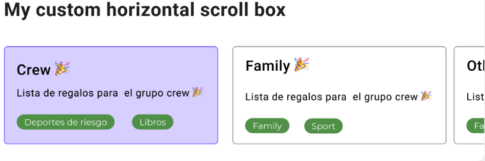
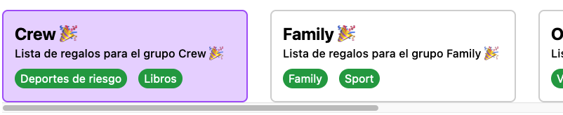

# JOBarcelona '22 | Gift list Front-end

> This project was realized for the JOBarcelona '22 Hackaton front-end category.
> Consists of allowing its users to create gift lists and customize them.

It basically render a ScrollBox with many cards inside of it, with horizontal scroller in PC resolution, but in Mobile resolution the scroll changes to vertically.

### Challenge



### Final result




### Live Version

https://jobx-front.vercel.app/

## Mocked Data

For testing purposes, mocked data has been created in order to display the information.


## Atomic design

I've chosen a folder structure based on Atomic Design (for more info https://bradfrost.com/blog/post/atomic-web-design/)

### Semantic HTML

In order to improve SEO and screen readers, I've used semantic HTML tags like <article> and <section>.

## Technologies

- React
- StoryBook
- TailwindCSS

## Installation

How to install the project

> This project dependencies were installed with npm

```shell
    # Clone repository
    git clone https://github.com/iigunchev/jobx-front.git

    # Install dependencies
    npm install
```

## Available Scripts

In the project directory, you can run:

### `npm start`

Runs the app in the development mode.\
Open [http://localhost:3000](http://localhost:3000) to view it in your browser.

The page will reload when you make changes.\
You may also see any lint errors in the console.

### `npm test`

Launches the test runner in the interactive watch mode.\
See the section about [running tests](https://facebook.github.io/create-react-app/docs/running-tests) for more information.

### `npm run build`

Builds the app for production to the `build` folder.\
It correctly bundles React in production mode and optimizes the build for the best performance.

The build is minified and the filenames include the hashes.\
Your app is ready to be deployed!

See the section about [deployment](https://facebook.github.io/create-react-app/docs/deployment) for more information.

To run your Storybook, type:

### `npm run storybook`

For more information visit: https://storybook.js.org

## Learn More

You can learn more in the [Create React App documentation](https://facebook.github.io/create-react-app/docs/getting-started).

To learn React, check out the [React documentation](https://reactjs.org/).

## License

[MIT](https://opensource.org/licenses/MIT)